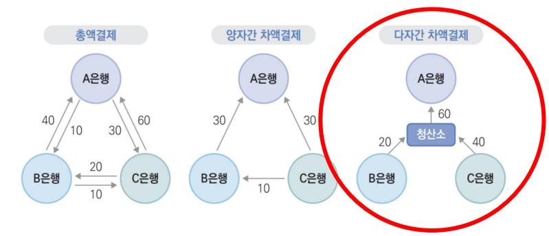
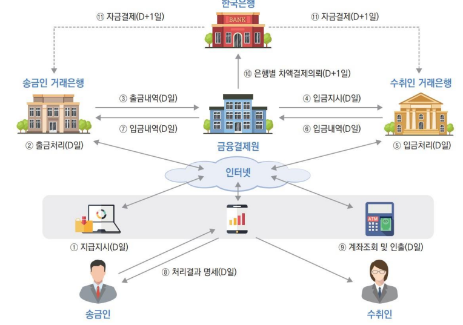
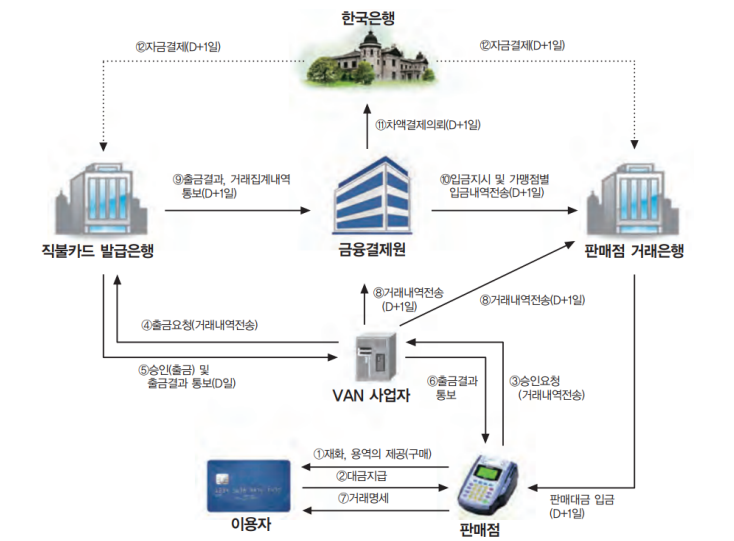
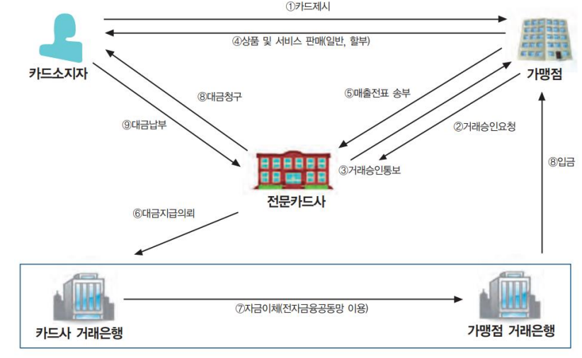
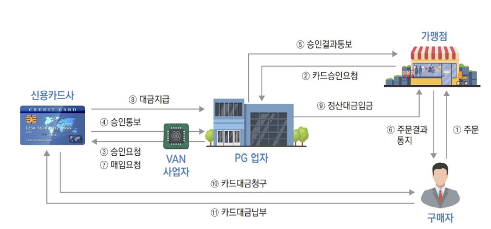
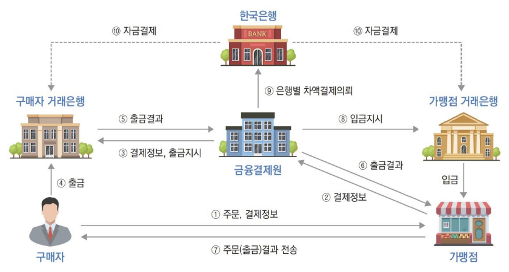
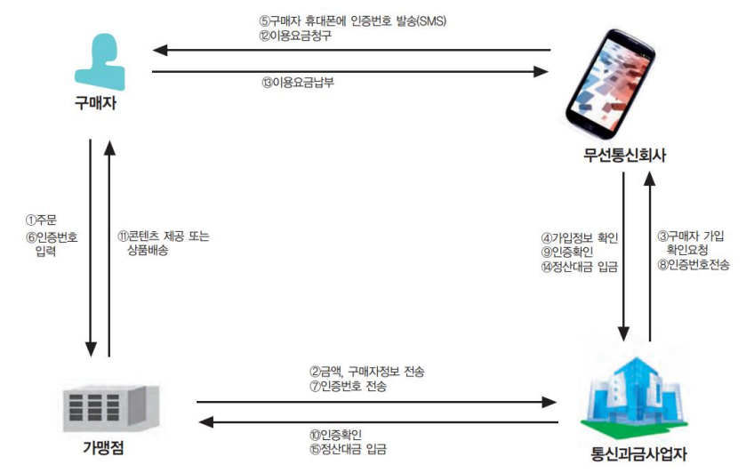
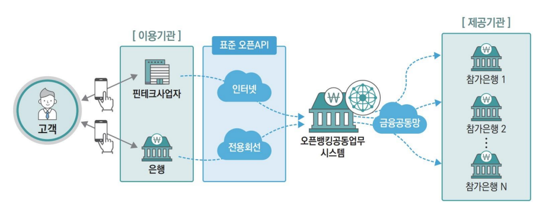

# Fintech
## 간편결제/지급결제
### 1. 지급결제서비스의 이해
* 지급결제의 개념: 경제주체들이 경제활도에 따른 채권채무관계를 지급수단을 이용하여 해소하는 행위
    - 현급(화폐): 그 자체로서 지급결제가 마무리
    - 어음, 수표, 신용카드, 계좌이체 등: 지급, 청산 및 결제의 세 단계를 거침

* 지급결제제도-결제시스템: 우리나라의 지급결제제도는 한국은행이 운영하는 한은금융망(BOK-Wire+)을 중심으로 하여  민간이 운영하는 소액결제시스템, 증권결제 시스템, 외환결제시스템 등이 밀접하게 연계

* 소액결제시스템 결제방식 비교

* CD공동망 현금인출 지급결제 절차

* 전자금융 공동망 지급결제 절차

* 직불카드공동망 업무처리절차

* 신용카드 결제시스템/오프라인-전문카드사

* 신용카드PG의 지급결제 절차/전자상거래

* 계좌이체PG의 지급결제 절차/전자상거래

* 통신과금서비스(무선저화결제)/전자상거래

* VAN(Value Add 과 PG-신용카드 기반 지급결제 구조
    - 오프라인 VAN의 역할: 가맹점과 카드사간 계약대행, 단말기 설치, 보안기능이 있는 통신망 운영(결제정보전달)
    - 온라인 VAN의 역할: 보안기능이 있는 통신망 운영(결제정보전달)
    - PG의 역할: 비대면거래 인증/보안문제 해결, 결제 대행, 쇼핑몰 관리

 

* 오픈뱅킹-금융권 공동 오픈API/핀테크서비스
    - API(Application Programming Interface): 특정 프로그램의 기능이나 데이터를 다른 프로그램이 접근할 수 있도록 미리 정한 통신규칙
    - 새로운 핀테크 기업이 지속적으로 출현할 수 있는 인프라 구축

* 오픈뱅킹-개념도: 여러 금융회사 앱을 설치할 필요 없이 하나의 금융기관이나 오픈뱅킹에 참여하는 핀테크 기업의 앱만으로 계좌를 조회하고 자금을 이체할 수 있는 서비스

---
### 2. 간편결제서비스

* 간편결제란? : 신용카드나 계좌정보를 스마트폰 앱 등에 등록해 지문인식이나 비밀번호 입력 등의 간단한 인증으로 빠르고 간편하게 결제하는 것

* 모바일 간편결제 방식

||결제방식|필요장비|
|:---:|:---:|:---:|
|MST(Magnetic Secure Transmission)|휴대폰을 이용해 카드/계좌 정보를 무선 전송으로 결제하는 방식|카드단말기|
|NFC(Near Field Communication)|근거리 무선통신을 이용한 비접촉식 결제방식|NFC단말기|
|Bar Code|생선된 바코드를 가맹점이 구비한 리더기를 이용해 결제|바코드 리더기|
|고정형 QR(Quick Response)|가맹점에 부착된 QR코드를 휴대폰 앱을 통해 카메라로 읽어 결제|고정형QR스티커|
|변동형 QR(Quick Response)|앱을 통해 생선된 QR코드를 가맹점 QR리더기를 이용해 결제|QR리더기|

* 인증방식
    - 비밀번호 인증
    - 소유 기반 인증서비스(OTP: One Time Password)
    - SMS 기반 인증 서비스
    - 생체인증 서비스
        - 지문인증: 땀, 먼지 등으로 인증 실패 가능성이 있음
        - 홍채인증: 대표적인 비접촉식 인증 방식
        - 얼굴인증: 얼굴 표정, 각도에 따라 식별 실패 가능성이 있음
        - 정맥인증: 노화나 외상에 의한 변형 가능성 낮음
        - 음성인증: 녹음 등을 통한 복제 가능성이 존재
    - 서버 기반의 생체인증
    - FIDO(Fast Identify Online)기반 생체 인증: 대표적인 삼성페이의 본인인증 수단

    ---

    ### 3. 산업 전망
    * 플랫폼 비즈니스
        - 지금결제 방식의 변화: 신용카드 -> 간편결제서비스
        - 경쟁기업:
         (ICT기업) 카카오, 네이버, 페이코, SK플래닛
         (유통회사) 신세계, 롯데, 지마켓, 배민페이, 쿠페이, SSG페이, 엘페이
         (제조사와 금융사) 삼성페이, 애플페이, 스마트폰뱅킹앱, QR페이
        - 경쟁전망: 간편결제시장을 주도하며 확장성 추구 -> 플랫폼 장악
    * 금융서비스 플랫폼으로의 진화
    * 고객접점, 채널의 중요성: D2C(Direct to Consumer) '소비자와 직접 만나서 거래한다'
    * 플랫폼 전략 수립의 중요성: '고객과의 접점 확보'
    * 디지털기술 접목 -> 고객과의 접점 확보 -> ICT 플랫폼

    * 핀테크산업 전망
        1. 금융업의 재편

            (중개사업자의 지배)
            - 서비스로서의 금융
                - 핀테크 기업의 비전: '금융을 관찰해 어렵고 번거로운 것들을 기술로 해결하고 유용하고 가치있는 서비스를 제공하는 것이 자신들의 비전' - 카카오페이
            - 금융 포털의 탄생
                - 금융의 모든 것: 은행, 카드, 투자, 보험 등의 다양한 금융서비스를 포괄적으로 제공
            - 포인트, 멤버십의 통합
                - 핀테크 서비스의 포인트 제공: 사용자 저변 확대, 적립 포인트의 관리/사용/환급 용이
                - 멤버심 통합관리 기능
            
            (오픈 파이낸스)
            - 통합 파이낸스: 오픈 뱅킹 -> 오픈파이낸스. 데이터와 금융서비스 개방
            - 선불 충전과 신용결제: 충성고객 확보, 쌓여진 금융데이터를 활용하여 신용결제 서비스 제공
         
         
        2. 핀테크 비즈니스 전망
            (금융의 디지털 전환 본격화)  
            - 오픈뱅킹,데이터3법, 통합파이낸스 등을 통한 핀테크 사업의 활성화 